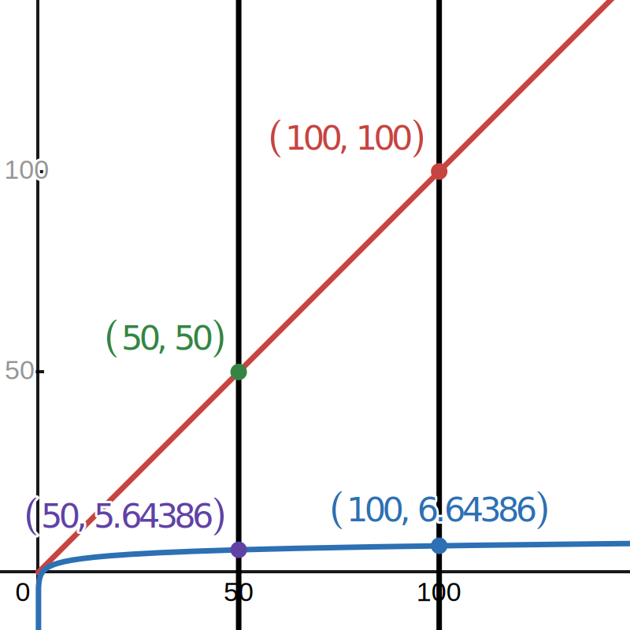

+++
title = 'Algumas ferramentas do Git que você talvez não conheça'
date = 2025-10-19T12:00:00-03:00
tags = ['git', 'today-i-learned']
+++

Vou apresentar duas ferramentas de busca que mais pessoas deveriam conhecer, e que talvez possam ajudar no seu dia-a-dia, trabalhando com Git.

## `git log -S`

Algo que você pode precisar fazer, por vezes, é descobrir em quais _commits_ uma função, variável ou conceito foi introduzido, removido ou alterado. 

O `git log -S`---carinhosamente chamado de "git pickaxe" devido à aparência da flag, que parece uma picareta---nos permite buscar nos _diffs_ do nosso repositório por uma _string_ que especificada. Isto é, ao invés de procurar nos arquivos, ele procura nas suas _mudanças_:

```sh
$ git log -S '+++'
commit a91d246f0a43fc2c33fd2aaef2f707c263f91b10
Author: Lucas Wolschick <snip>
Date:   Sat Oct 11 21:01:06 2025 -0300

    ajustes adicionais e novo post

commit 37d43c20e93319cd62990d9bba74dca6058ef74b
Author: Lucas W. <snip>
Date:   Wed Oct 8 22:25:00 2025 -0300

    blog post: resoluções

commit 9f201047ba32ae3a92c0deebced41e689a9152ac
Author: Lucas W. <snip>
Date:   Wed Oct 8 21:49:47 2025 -0300

    blog: Futuro

[...]
```

Se consultarmos um dos _commits_ que a ferramenta retornou, vemos que, realmente, a _string_ '+++' foi introduzida nele:

```sh
$ git show a91d246f0a43fc2c33fd2aaef2f707c263f91b10
commit a91d246f0a43fc2c33fd2aaef2f707c263f91b10
Author: Lucas Wolschick <snip>
Date:   Sat Oct 11 21:01:06 2025 -0300

    ajustes adicionais e novo post

diff --git a/blog-src/content/posts/novo-tema-blog.md b/blog-src/content/posts/novo-tema-blog.md
new file mode 100644
index 0000000..db6d1f4
--- /dev/null
+++ b/blog-src/content/posts/novo-tema-blog.md
@@ -0,0 +1,11 @@
++++
+date = '2025-10-11T20:27:16-03:00'
+title = 'Novo tema'
+tags = ['blog']
++++
+
+Fiz algumas melhorias na navegabilidade do blog e refiz o layout dele...

[...]
```

Dito de outra forma, nas palavras do [livro Pro Git](https://git-scm.com/book/pt-br/v2/Git-Tools-Searching), ele é útil quando "você não está procurando _onde_ um termo existe, mas _quando_ ele existe ou foi introduzido." Você não está mais procurando no espaço, está procurando no tempo.

### Um exemplo prático

Essa semana, no trabalho, eu estava refatorando uma classe e tive que remover um pouco de código antigo. O projeto do qual participo possui uma *quality gate* que requer 100% de cobertura dos testes para que as mudanças possam ser integradas na `master`. Após a refatoração (que teve vários _commits_), vi que a cobertura tinha diminuído para 99%.

Estranhado, fui ver no relatório de cobertura e descobri que as minhas mudanças fizeram com que um dos métodos do projeto deixasse de ser usado. Porém, eu não lembrava de ter visto esse método em lugar nenhum enquanto trabalhava. Para ver se eu tinha feito besteira e apagado algo que não deveria, fui lá e executei o `git log -S`:

```sh
git log -S 'MethodNameGoesHere' --oneline -p
```

Vendo o modo como ele era usado, pude confirmar que eu podia remover ele sem problemas.

> 💡 **Dica:** a flag `-p` imprime na tela o _diff_ do _commit_, e a flag `--oneline` o mostra de maneira resumida---apenas o hash e primeira linha da mensagem. Outra flag útil é `--reverse`, para mostrar os commits mais velhos primeiro.

Outro exemplo! Suponha que queremos identificar os _commits_ onde uma chamada de log foi introduzida ou removida:

```sh
git log -S '.Info(' --oneline -p
```

Pode ser útil se você está monitorando o uso de _logging_ na sua aplicação.

### Flags adicionais

Ao invés de `-S`, você pode usar `-G` caso queira usar uma expressão regular, ou `-L` para acompanhar como uma função evoluiu ao longo do tempo. Confira a documentação do `git log --help` para mais detalhes.

Experimente e me conte os resultados :-)

## `git bisect`

Suponha que você esteja corrigindo um bug, mudança de comportamento indesejada ou regressão de desempenho. Suponha, além disso, que você não faz ideia do porquê o problema existe. Porém, você sabe que foi uma mudança no código-fonte que causou isso. Como você  descobriria a causa raiz do problema de um modo eficiente?

O `git bisect` permite que você encontre _commits_ que introduziram mudanças e/ou bugs de um jeito rápido e automatizável.

Como funciona? Você primeiro determina dois _commits_: um onde o problema não existia, e outro onde o problema passou a existir.

```sh
$ git bisect start
$ git bisect bad # commit atual tá quebrado
$ git bisect good master # mas o commit da master tá ok
```

A partir daí, o `git bisect` vai te levar numa aventura mágica pelo seu repositório, te fazendo perguntas estranhas, para no fim lhe revelar, como se numa epifania, onde o problema surgiu[^1].

[^1]: Que nem o [Akinator](https://akinator.com), só que para bugs no seu código.

...

Perdão?

As instruções são simples: o `git bisect` vai realizar alguns `checkouts` de commits específicos e mostrar eles para você. Após cada `checkout`, dê uma olhada no seu repositório e verifique se o problema existe. Se o _commit_ estiver bom, você fala `git bisect good`. Se está ruim, você fala `git bisect bad`.

Um exemplo, se eu estivesse procurando por uma mudança na estilização do [meu currículo](/cv/):

```sh
$ git bisect start
status: waiting for both good and bad commits
$ git bisect good 9174a31
status: waiting for bad commit, 1 good commit known
$ git bisect bad
Bisecting: 8 revisions left to test after this (roughly 3 steps)
[1be4c73e3b26e32612033d7e7352a0be64a8fe25] Add files via upload
$ git bisect bad
Bisecting: 3 revisions left to test after this (roughly 2 steps)
[1b8d82e79ef4771408e2bed2aa15f01d2deda101] adjustments
$ git bisect bad
Bisecting: 1 revision left to test after this (roughly 1 step)
[a15326b88f1cd38b7716c179359b101eb565b63f] open graph
$ git bisect good
Bisecting: 0 revisions left to test after this (roughly 0 steps)
[248fc95bdb0513609652088e34c7c9735698ed8d] open graph 2
```

Quando não houver mais commits para responder, ele vai avisar:

```sh
$ git bisect good
1b8d82e79ef4771408e2bed2aa15f01d2deda101 is the first bad commit
commit 1b8d82e79ef4771408e2bed2aa15f01d2deda101
Author: Lucas Wolschick <snip>
Date:   Sun Sep 21 20:03:52 2025 -0300

    adjustments

 README.md   |  1 +
 cv/main.css | 15 +++++++++++++--
 index.html  |  4 ++--
 3 files changed, 16 insertions(+), 4 deletions(-)
 create mode 100644 README.md 
```

E eis que você descobriu qual é o commit que introduziu o bug. 

### Funcionamento do `git bisect`

Repare na primeira linha que ele exibiu após o ponto de partida e de fim serem especificados:

```txt
Bisecting: 8 revisions left to test after this (roughly 3 steps) 
```

Como ele consegue verificar 8 _commits_ em apenas 3 passos?

O `git bisect`, internamente, executa uma busca binária sobre o histórico de _commits_ do repositório dentro do intervalo especificado. Basicamente, ele corta o seu intervalo de _commits_ no meio e pergunta: nesse ponto, está bom ou ruim? 

- Se estiver bom, então eu sei que o problema está na segunda metade do seu intervalo, e eu não preciso mais ver nada da primeira metade.
- Se estiver ruim, então o problema aconteceu na primeira metade, e a segunda pode ser descartada.

Ou seja, a cada passo, ele joga metade dos problema restante fora[^2].

Puxando a sardinha aqui para a aula de análise de algoritmos lá da faculdade, a complexidade de tempo da busca binária é \(O(\log_2{n})\), enquanto a da busca linear é \(O(n)\). O logaritmo aqui surge do resultado dessa relação recorrência:

\[
    T(n) = T\left(\frac{n}{2}\right) + c
\]

Pelo teorema mestre, a forma fechada dessa relação é:

\[
    T(n) = c\log_2{n}+c' \in O({\log_2{n}})
\]

Sendo \(c'\) o custo para resolver o caso base e \(c\) o custo constante para resolver o caso recursivo.

[^2]: O nome do comando vem daí: ele faz uma _bisseção_ do histórico de _commits_.

Dito de outra forma, devido ao modo como ele funciona, ele conseguiria avaliar 10 000 commits em apenas 14 passos!



Uma tabela comparativa mostrando o número de _commits_ (coluna esquerda) e o número de passos (coluna direita) que o `bisect` teria de avaliar:

| \(n\) | \(\log_2{(n)}\) |
|:-:|:-:|
| 1 | 0 |
| 10 | ~3,32 |
| 100 | ~6,64 |
| 1000 | ~9,97 |
| 10000 | ~13,29 |

Além disso, o `git bisect` é esperto o suficiente para conseguir lidar com outras topologias de _commits_ que não são apenas linhas retas, processando _merges_ sem problemas. Legal, não?

### Automatizando a bisseção

Você pode escrever um comando, programa ou _script_ para automatizar a sua busca. Se o seu programa retorna 0 quando o _commit_ está OK e 1 quando o _commit_ tem erro, você pode passar ele para o `bisect` da seguinte forma:

```sh
$ git bisect run dotnet test --filter "FullyQualifiedName~ClassNameTests"
```

Aqui, ser criativo te recompensa. Por exemplo, segue um _script_ que verifica se o tempo de execução de um programa leva mais que 10 segundos:

```bash
# measure_10.sh
#!/usr/bin/env bash
set -e

START=$(date +%s)
python3 script.py > /dev/null 2>&1
END=$(date +%s)

ELAPSED=$((END - START))

[ "$ELAPSED" -gt 10 ] && exit 1 || exit 0
```

Usando ele:

```sh
$ git bisect run ./measure_10.sh
```

## Fontes

Esses comandos são explicados em detalhes no livro oficial do Git, o [Pro Git](https://git-scm.com/book), que pode ser encontrado de graça no site do Git e tem tradução parcial para português. Se você gostou, vale a pena dar uma lida e ver :-)